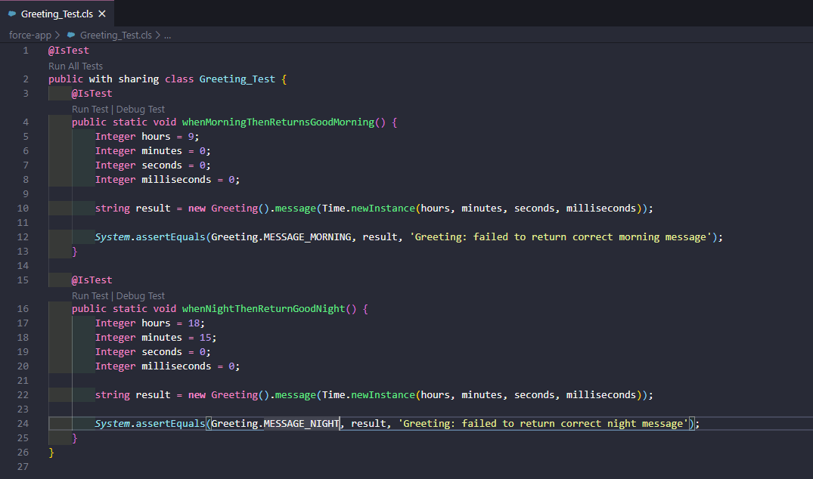
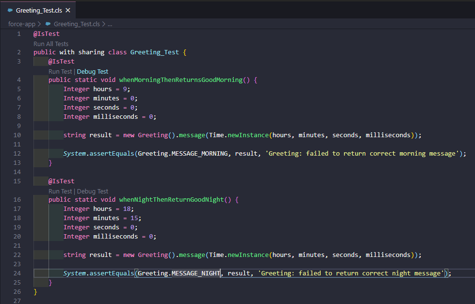

Salesforce SFDX Debug Single Test
=========================

## Background

This is a [Visual Studio Code extension](https://code.visualstudio.com/docs/introvideos/extend) for [Salesforce SFDX development](https://developer.salesforce.com/docs/atlas.en-us.sfdx_dev.meta/sfdx_dev/sfdx_dev_intro.htm); it provides 
- [code lens](https://vscode.rocks/codelens/) that invokes the Apex Replay debugger to allow simple debugging against a single test

The code was written during a Firebreak at work. The Firebreak is a quiet time of the year when business is slow and colleagues are on vacation so it's difficult to make accurate plans. During the Firebreak I often use the time for those improvements that never quite reach the top of the backlog or for sub-projects or innovation.

On one such Firebreak I tackled a few subjects and came out with two fun applications. The first application was a program to Visualise calls into API's by way of a variation of pong/breakout game where requests are batted back to the caller, all very whimsical but not very practical.

The second application is a re-visit to Visual Studio Code plugins and making use of some existing plugins by simplifying the [Salesforce Apex Replay Debugging process](https://salesforcedx-vscode.netlify.app/tools/vscode/en/apex/replay-debugger/). 

## Requirements

If using the extension you will need
- Visual Studio Code
- Salesforce Extensions installed
- Java (runs the Apex Language Server)

For Development you will need the above plus
- LTS version of Node

## Usage

Install the extension and open an Apex test class decorated with the @IsTest attribute, for each test method alongside the Run Test code lens will appear a Debug Test code lens



Hovering over the Debug Test highlights the code lens, clicking on Debug Test will do the following



Clicking the Debug Test code lens will
- update the Org with checkpoints
- turn on Apex log for debugging
- run the test
- download the last Apex log
- open the Apex log
- invoke the debugger

The Salesforce debug log is automatically downloaded and assumes the following
- developer is using scratch org
- developer is only person using scratch org
- debug log of the test session has been saved and is ready for downloading shortly after the test has concluded

If you were to run the commands for Apex replay debugging by hand the debug log is downloaded by opening Visual Studio Code command palette and selecting **SFDX: Get Apex Debug Logs**, the command will then query Salesforce for all available logs and allow the developer to pick the correct log. This extension sits on top of the existing Salesforce extension and therefore can also prompt the developer for a debug log as it can leverage the same command!

In order to change the logic from automatically downloading the debug log to displaying a prompt go to [debugUnitTest.ts](src/commands/debugUnitTest.ts) and change it from
```typescript
  // The command below will prompt for a log file ... default behavior
  //    await vscode.commands.executeCommand('sfdx.force.apex.log.get');

  // The command below will get the latest log file
  await apex.getLatestLog();
```

to

```typescript
  // The command below will prompt for a log file ... default behavior
  await vscode.commands.executeCommand('sfdx.force.apex.log.get');

  // The command below will get the latest log file
  // await apex.getLatestLog();
```

## Known issues

The code lens makes use of the language server and does not cache any information, the code lenses are updated on a frequent basis and this results in a resource heavy extension.

This could be improved by caching the results from the Apex server but would require subscribing to an event or providing a mechanism for refreshing the cache.

## Licence

None, this is just for fun but if you like the idea then please clone the repo.